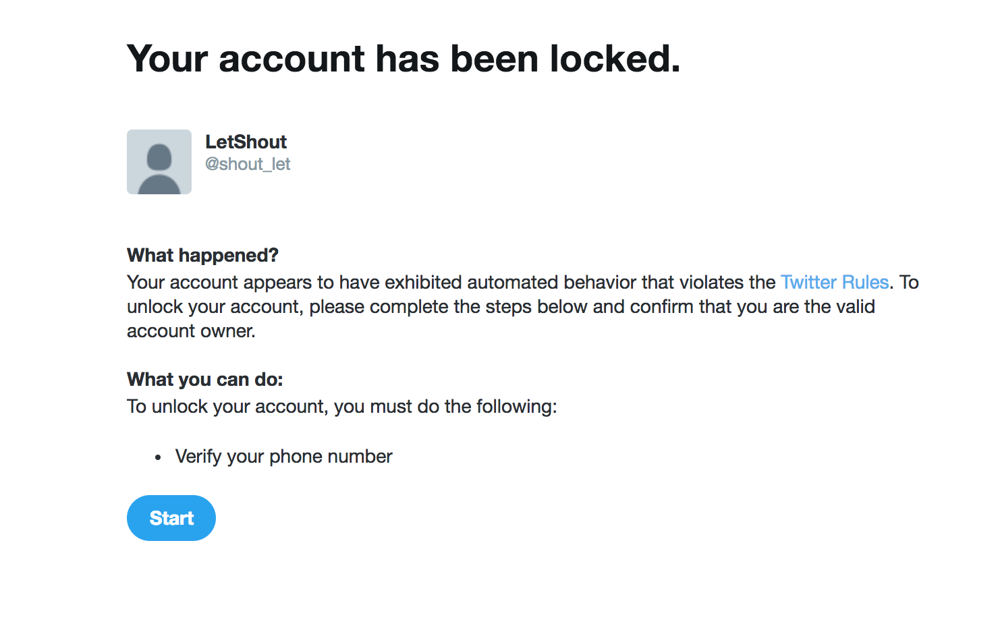

# Purpose

Investigate different alternatives to get the TimeLine of a Tweeter account


## Investigation using the official API

From [Twitter documentation official libraries](https://developer.twitter.com/en/docs/developer-utilities/twitter-libraries)
1. [HorseBird Client](https://github.com/twitter/hbc) consuming Twitter's Streaming API. Uses internally [twitter4j](http://twitter4j.org/en/index.html) to get timeline     

## Investigation using non official API

1. [Github library](https://github.com/Jefferson-Henrique/GetOldTweets-java) to use *Advanced Search*
    * **PROS**: No limitation of number of tweets
    * **CONS**: Not all the tweets are present. [See documentation](https://help.twitter.com/en/using-twitter/twitter-search-not-working)


2. [Github library](https://github.com/tomkdickinson/TwitterSearchAPI) to use timeline API `https://twitter.com/i/search/timeline?&q=from:LetGo&f=tweets`
    * After testing it, it is not parsing correctly [timeline](src/main/java/twitter/TwitterAPITimelineTest.java)

3. [Custom library](src/main/java/twitter/ScrollDownAPI.java) calling when using *ScrollDown* feature and scrapping HTML elements
    * **PROS**: No limitation in number of requests
    * **CONS**: Limitation of number from 800 to 900 tweets
4. [twitter4j](http://twitter4j.org/en/index.html) is an unofficial Java library for the [Twitter API](https://developer.twitter.com/en/docs).


## Consideration

* For this project to retrieve timeline of a given user, I used [twitter4j](http://twitter4j.org/en/index.html) library

    [Get Timeline of user](https://developer.twitter.com/en/docs/tweets/timelines/api-reference/get-statuses-user_timeline.html) has restrictions:
    ```
    Response formats	JSON
    Requires authentication?	Yes
    Rate limited?	Yes
    Requests / 15-min window (user auth)	900
    Requests / 15-min window (app auth)	1500
    ```
* Used __auth key__ found in GitHub [Many Thanks!](https://github.com/cyang-prosper/spring-boot-kubernetes/blob/2aa5ad585603484893d9c201919d91a2f86922a6/spec-files/twitter-acct-configmap.yml)

    If you want to use your own Twitter _authentication keys_, set as JMV parameters:
    
    * `OAuthConsumerSecret`
    * `OAuthConsumerKey`
    * `OAuthAccessToken` 
    * `OAuthAccessTokenSecret`
 
as `-DOAuthConsumerSecret=XXXXX -DOAuthConsumerKey=XXXXX -DOAuthAccessToken=XXXXX -DOAuthAccessTokenSecret=XXXXX`

* In order to reduce requests to Twitter, Twitter provides [Pagination feature](https://developer.twitter.com/en/docs/tweets/timelines/guides/working-with-timelines)

    > The maximum in paging is [1000](https://developer.twitter.com/en/docs/ads/general/guides/pagination)
   
    But when using [twitter4j](http://twitter4j.org/en/index.html) the maximum is **200**, the documentation states it for performance reasons in the deprecated method [getUserTimeline](http://twitter4j.org/oldjavadocs/2.0.10/twitter4j/Twitter.html#getUserTimeline(twitter4j.Paging))

* `MainServerTest` could use more strict validation of the output. [Json Schema Validator](https://mvnrepository.com/search?q=JSON+Schema+Validator) could have been used.


##### Restrictions in supported twitter API utilization

[Rules and policy](https://help.twitter.com/en/rules-and-policies/twitter-automation)
>  Don’t!
> * Violate these or other policies. 
> * Be extra mindful of our rules about abuse and user privacy.
> * Abuse the Twitter API or attempt to circumvent rate limits.
> * Use non-API-based forms of automation, such as scripting the Twitter website. The use of these techniques may result in the permanent suspension of your account.

##### Restrictions in [timelines Twitter API](https://developer.twitter.com/en/docs/tweets/timelines/api-reference/get-statuses-user_timeline.html)
        
>  This method can only return up to 3,200 of a user’s most recent Tweets. Native retweets of other statuses by the user is included in this total, regardless of whether `include_rts` is set to false when requesting this resource.
>
> _Resource URL_  https://api.twitter.com/1.1/statuses/user_timeline.json
>
> _Resource Information_

        Response formats	                    JSON
        Requires authentication?	            Yes
        Rate limited?                           Yes
        Requests / 15-min window (user auth)    900
        Requests / 15-min window (app auth)	    1500


#### Restrictions creating account

Because I did not provide a phone number:
  
 


## Solution Implementation details

* The `main()` method is in *MainServer.java* which spawns a http server using exclusively classes inside the JDK, the reason is to tune up a policy for request overflow.

* The operation to retrieve the tweets is idempotent therefore GET is used

* If we want to create new endpoints we will create a new class implementing __Handler__ interface and adding the logic to trigger in __FactoryHandler__
 
* Tweets can be locale sensitive to identify the language in order to represent it, [Locale class](https://docs.oracle.com/javase/8/docs/api/java/util/Locale.html) is used.
 
* Since no information is stored, no need to monitor the memory, but if cache is implemented, overflow error can lead to *Memory leaks*

* Handling exception: [getUserTimeline](http://twitter4j.org/oldjavadocs/2.0.10/twitter4j/Twitter.html#getUserTimeline(twitter4j.Paging)) throws a checked exception [TwitterException](http://twitter4j.org/javadoc/twitter4j/TwitterException.html) 
and it is handled in __MainServer#initizalizeContext()__ but it could throw an unchecked exception, this is the reason that `} catch (Exception e) {` is handled inside this method.
 
* Use UTF-8 to decode chars, Emoti will be represented but not Japanese Kanji
 
* If request is not GET with the correct parameters, the reason won't be shown
 
* Used system.out.println when error as max memory reached or unchecked exception caught but in further steps use logging mechanism 


##### Testing 

* The code was implemented using TDD, divided first into 2 modules creating the Server and creating the Request Handler and then joining using Integration Tests

* Unit test can run without Internet connectivity, regression test need it
 
* Test using _Non official_ and __not supported__ *Search Advanced* library fails *erratically*. See test [AdvancedSearchAPITest.java](https://angel.co/shedd-2/jobs/338695-lead-backend-engineer) `searchNumberTweetsByUser_3201tweets()`
 
 
    org.json.JSONException: JSONObject["min_position"] not a string.
 	at org.json.JSONObject.getString(JSONObject.java:725)
 	at me.jhenrique.manager.TweetManager.getTweets(TweetManager.java:81)
 	at twitter.AdvancedSearchAPI.searchNumberTweetsByUser(AdvancedSearchAPI.java:39)
 	at integration.twitter.AdvancedSearchAPITest.searchNumberTweetsByUser_3199tweets(AdvancedSearchAPITest.java:65)
 	java.lang.AssertionError: 
 	
    Expected size:<3199> but was:<157> in:
        ...

* **Load testing** using _JMETER_ is a iteration of a simple request with same _username_ and _tweet_number_ [inside the project](src/test/resources/LoadTest_letShout.jmx)


## Strategy to use for implementing the cache

Uses cases when cache is **invalidated**:
    
1. A user is _disabled/blocked/removed_
2. A new Tweet is created 
3. A user removes a tweet

Possible ways to solve it:
1. If __invalid user__: Use [Twitter API](https://developer.twitter.com/en/docs/accounts-and-users/follow-search-get-users/api-reference/get-users-lookup) to look up for a username, if it does not exists, evict the cache and return empty response.
2. If __new tweets created__: Use implemented library to scrape _API ScrollDown_ does not have request limit, to validate that the first 5 tweets are in the top of the cache:
    * If not included: Use the [getUserTimeline](http://twitter4j.org/oldjavadocs/2.0.10/twitter4j/Twitter.html#getUserTimeline(twitter4j.Paging)) and append the tweets to the cache
    * If included: Return the latest `num_tweets` in the cache
3. If __tweet is removed__: Use [Account activity Twitter API](https://developer.twitter.com/en/docs/accounts-and-users/subscribe-account-activity/overview) to subscribe to a user activity. Since the service that allows to get the activity for **any** user is a [Enterprise service](https://developer.twitter.com/en/docs/accounts-and-users/subscribe-account-activity/overview) that requires a [paid subscription](https://developer.twitter.com/en/pricing)
In case we have access to an [Enterprise Subscription API](https://developer.twitter.com/en/docs/accounts-and-users/subscribe-account-activity/api-reference/aaa-enterprise)
    * If user not in cache: Add it to the cache and store the retrieve latest tweets from [getUserTimeline](http://twitter4j.org/oldjavadocs/2.0.10/twitter4j/Twitter.html#getUserTimeline(twitter4j.Paging)) Twitter API and the time of the latest activity. Then subscribe to the user activity
    * If user in cache: 
        1. Check the activity from the subscription of the given user. 
        2. If user has deleted tweet from the last 
        4. Update time of the latest activity
    
    A _free_ price alternative is to use Twitter Stream to retrieve deleted tweets, [Stackoverflown answer](https://stackoverflow.com/a/5955102) but Streaming Twitter API is [deprecated](https://developer.twitter.com/en/docs/accounts-and-users/subscribe-account-activity/guides/us-ss-migration-guide) and the documentation is [not available](https://developer.twitter.com/pages/streaming_api_concepts)


## Further improvements to reduce Twitter API calls

* Use the Twitter API to obtain the API [rate limit status](https://developer.twitter.com/en/docs/developer-utilities/rate-limit-status/api-reference/get-application-rate_limit_status) before querying the [timeline API]((https://developer.twitter.com/en/docs/tweets/timelines/api-reference/get-statuses-user_timeline.html))
* Using a proper logging mechanism to triage errors
* The client can throttle its requests if  the server adds more info when a request is not success:
    * Quota limit reached
    * Http request parameters not correct
    * User does not exist


## Development environment

* Java version: 8
